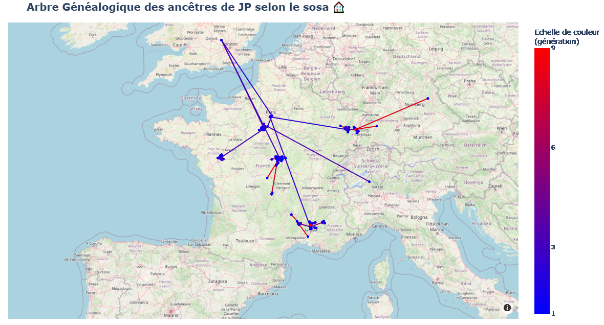

# Projet personnel : Affichage géographique des ascendants, à partir du numéro sosa et du code INSEE

### Objectif :
---
L'objectif de ce projet est de pouvoir visualiser la localisation de ses ascendants généalogiques sur une carte du monde.  
En utilisant le numéro sosa et le code insee associé, il est possible d'afficher le lieu et les liens, si connus (par un trait vers l'enfant et deux traits vers les parents).  
L'échelle de couleur indique l'éloignement depuis le 1 (origine de l'arbre).  

### Instructions :
---
- Affichage de la carte généalogique :
    - lancer le fichier *app.py*
    - obtenir la carte sur un navigateur web via http://127.0.0.1:5000

### Ajout de données
---
- modifier le fichier *villes.csv* dans le dossier *data*, en suivant les indications
    - colonnes : 
        - **sosa** (entier positif à partir de 1), 
        - **insee** (cas hors france : coordonnées lat/lon sous ce format [x.x,x.x], cas france : code insee de 4 ou 5 caractères), 
- lancer *traitement.py* et vérifier qu'il n'y a pas d'erreur

## 🔗 Démo

[👉 Cliquez ici pour voir la visualisation en ligne (déployé via render)](https://carte-genealogique-2.onrender.com/)
